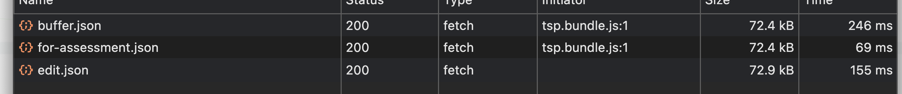
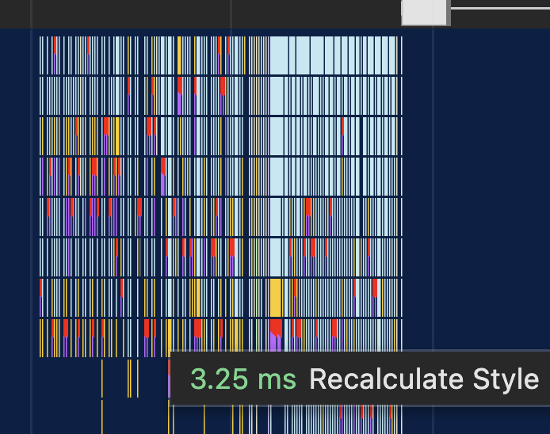
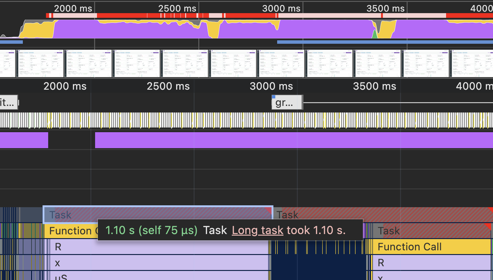
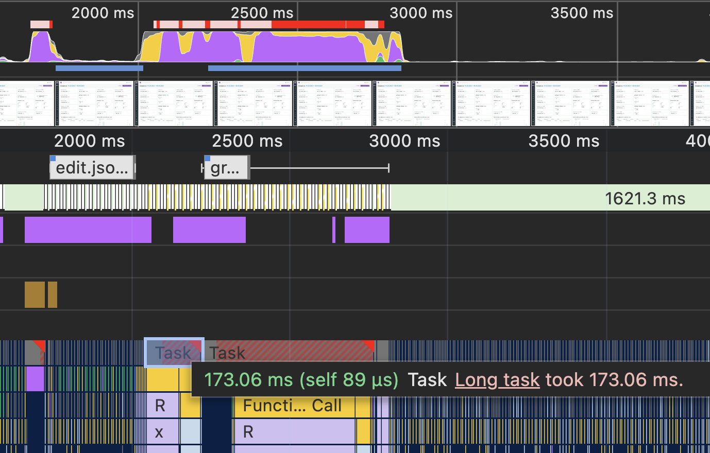

# CRM Quick overview

## Кодогенерация

Отлично, что в проекте используется много самописной кодогенерации и реализовано все очень компетентно. Учитывая большое количество типовых страниц и элементов, это замечательно, что вы задумались над этим, разработка ускоряется очень сильно, когда ты тратишь времени на бойлерплейт. Генерация и использование роутов очень удобны. Хотя есть места, где для редиректов используются обычные строки, но это потому, что эти участки кода были написаны до внедрения кодогенерации. 
Если нет возражений и причин по которой они там остаются, я бы предложил заменить все места, где до сих пор используются обычные строки конструкцию `linkTo`.

## i18n

Я раньше использовал его только в формате, когда в коде используются ключи для словаря, и руками эти самые словари заполняем, зачастую без команды переводчиков. Реализацию без ключей я вижу впервые, то что сервис переводов интегрирован в сам разрабатываемый проект – это просто волшебство :). + очень удобно искать в коде места которые видишь в интерфейсе. 
Я только хочу заметить, что сейчас при использовании `getServerSideProps` каждая страница дублирует `getI18NextProps` и получает все имеющиеся переводы – на данный момент это больше 4000 строк или 70+ кб. Может быть имеет смысл подумать над тем, как грузить только те переводы, которые используются на странице. Или хотя бы загружать файл с переводами один раз и переиспользовать на всех страницах:



## Структура проекта

Структура проекта очень удобная. Несмотря на внушительную кодовую базу, я почти всегда могу найти файл с нужным UI элементом, пользуясь только навигацией по директориям, без необходимости в поиске. Всё очень логично структурировано и выдержано в едином стиле. 
Попробовал написать типовую страницу с нуля, и я всегда знаю куда именно нужно положить файл, как его назвать и т.п, для того чтобы проект оставался консистентным. 

## Производительность

Я сконцентрировался на главной странице с дашбордом (потому что она мне показалась наиболее загруженной различными элементами). Сначала мне показалось, что страница грузится очень долго, и так же долго переходит в режим редактирования. Дело оказалось в dev режиме, но даже в продакшен билде есть места, где хочется чтобы приложение было более отзывчивым. 

Я много времени потратил на то, чтобы через Profiler расследовать что именно замедляет загрузку страницы. Часто шел по ложному следу. Винил next/router и handleSmoothScroll, компонент Tag из CrmCore, который используется для отображения "Казино"/"Спорт". Он правда немного проблемны, и судя по всему вызывает [Layout Thrashing](https://developers.google.com/web/fundamentals/performance/rendering/avoid-large-complex-layouts-and-layout-thrashing), т.к. читает и записывает значения в DOM. [source](https://gitlab.xbet.lan/services/web/crm/libs/webx.libs.crm.ui-kit/-/blob/master/packages/webx.libs.crm-core/src/components/tag/hooks/useLongContent.ts). Я бы предложил ставить title для всех тегов, не только с overflow, мне кажется это хорошей практикой. 

Было еще несколько вариантов, все ложные и на время рендера при переходе в режим редактирования особо не влияли. В конце концов я все-таки решил обратить внимание на слона в комнате. Обратите внимание на большое количество маленьких ивентов, которые отмечены красным – это расчет стилей для ApexCharts. 



Огромное количество виджетов на странице создает нагрузку не только на рендер, но и на анмаунт компонентов.
Я решил задачу в лоб, добавил наивную виртуализацию, чтобы не рендерить виджеты с графиками, которые находятся за пределами viewport'a.

```tsx
const useVisibility = (options?: UseVisibilityOptions) => {
    const [isVisible, setIsVisible] = useState(false);
    const ref = useRef<HTMLDivElement>(null);

    useEffect(() => {
        const observer = new IntersectionObserver(([entry]) => {
        setIsVisible(entry.isIntersecting);
        }, options);

        if (ref.current) {
        observer.observe(ref.current);
        }

        return () => {
        if (ref.current) {
            observer.unobserve(ref.current);
        }
        };
    }, [options]);

    return [ref, isVisible];
};

...

<GridItemSC rowHeight={rowHeight} origin={item} ref={ref}>
    {isVisible && renderItem(item)}
</GridItemSC>
```

Удалось добиться сокращение времени которое нужно на unmount страницы с summary почти в 10 раз.

До:


После:
 

Однако это решение очень в лоб, сейчас например, данные фетчатся при появлении виджета во вьюпорте. Думаю, имеет смысл подумать над более оптимизированным решением.

## Другое

- Я пока не успел, но очень хотел бы попробовать добавить генерацию статики через next, чтобы сразу получать предварительные версии всех страниц. 

## ---

Над проектом очень приятно работать как разработчику. Много полезных инструментов, грамотно организованная структура и иерархия папок/зависимостей, везде где возможно переиспользуются общие компоненты. Developer experience потрясающий. Есть небольшие вещи, которые я бы предложил оптимизировать, для того чтобы пользователем стало еще комфортнее. 
